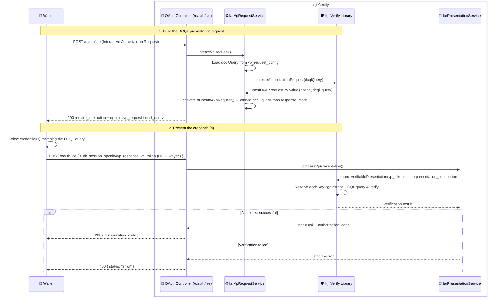

# DCQL Support (Digital Credentials Query Language)

This document explains how Inji Certify uses **DCQL — the Digital Credentials Query Language** defined by [OpenID for Verifiable Presentations (OpenID4VP)](https://openid.net/specs/openid-4-verifiable-presentations-1_0.html#name-digital-credentials-query-l). DCQL is the mechanism Certify uses to tell a wallet *which* credential(s) it must present during the **Presentation During Issuance** (Interactive Authorization Request / IAR) flow.

> **Note:** DCQL is used **inside** the Presentation During Issuance flow. Read [Presentation During Issuance](./Presentation_During_Issuance.md) first for the end-to-end sequence; this document zooms into how the presentation request is expressed.

---

## Overview

When Certify requires the user to present an existing credential before issuing a new one, it must describe *what* it wants — a credential type, format, and the constraints it must satisfy. Earlier OpenID4VP drafts expressed this with `presentation_definition` (DIF Presentation Exchange). OpenID4VP 1.0 replaces that with **DCQL**, a compact JSON query language that:

- names the credential **format** (`ldp_vc`, `dc+sd-jwt`, `mso_mdoc`, …),
- constrains it by **type / claims / metadata**, and
- expresses **sets of alternatives** ("present A, or B and C").

Because the response is keyed by the query, DCQL mode does **not** use a `presentation_submission` object — the `vp_token` alone maps each presented credential back to the query that asked for it.

**How Certify uses it:**

1. Certify reads a **`dcqlQuery`** block from its VP request configuration file (`mosip.certify.vp-request.config-file-url`).
2. The embedded [inji-verify library](./Inji_Verify_As_A_Library.md) turns it into an OpenID4VP authorization request (by value), parsing it into a `DCQLQueryDto`.
3. Certify embeds the query as **`dcql_query`** inside the `openid4vp_request` returned to the wallet in the Interactive Authorization Response.
4. The wallet selects credentials that satisfy the query, builds a DCQL-keyed `vp_token`, and posts it back to Certify's `/oauth/iae` endpoint.
5. Certify forwards the `vp_token` to the inji-verify library for verification. In DCQL mode **only `vp_token` (and state) are required — there is no `presentation_submission`.**

---

## The `dcqlQuery` Configuration Block

The query lives in the VP request config file. Below is the shipped default (`vp_request_config.json`), which asks for a single MOSIP identity credential in `ldp_vc` format:

```json
{
  "dcqlQuery": {
    "credentials": [
      {
        "id": "mosip_verifiable_credential_id",
        "format": "ldp_vc",
        "meta": {
          "type_values": [
            [
              "https://www.w3.org/2018/credentials#VerifiableCredential",
              "https://inji.github.io/inji-config/contexts/mosip-identity-context.json#MOSIPVerifiableCredential"
            ]
          ]
        }
      }
    ],
    "credential_sets": [
      {
        "options": [
          [
            "mosip_verifiable_credential_id"
          ]
        ]
      }
    ]
  }
}
```

| Field | Meaning |
|---|---|
| `credentials[]` | The list of credential queries. Each has a unique `id` used to key the wallet's `vp_token`. |
| `credentials[].id` | Identifier the wallet echoes back so each presented credential maps to the query it answers. |
| `credentials[].format` | Requested credential format (`ldp_vc`, `dc+sd-jwt`, `mso_mdoc`). |
| `credentials[].meta.type_values` | Format-specific type constraint. For `ldp_vc` this is the set of JSON-LD `@context`/type IRIs the credential must carry. |
| `credential_sets[]` | Groups of `options`, where each option is a list of credential `id`s that together satisfy the request. Expresses "present this set, **or** that set". |

To require a *different* or *additional* credential, add another entry to `credentials[]` and reference its `id` in `credential_sets.options`.

---

## The `dcql_query` in the Wallet-Facing Request

After the inji-verify library produces the authorization request, Certify assembles the `openid4vp_request` and embeds the query under the `dcql_query` key (see `IarVpRequestService.convertToOpenId4VpRequest`), for example:

```json
{
  "response_type": "vp_token",
  "client_id": "certify-verifier-client",
  "nonce": "…generated by the verify library…",
  "dcql_query": { "credentials": [ ... ], "credential_sets": [ ... ] },
  "response_mode": "iae_post",
  "response_uri": "http://localhost:8090/v1/certify/oauth/iae"
}
```

`response_mode` is mapped from the verify library's `direct_post` / `direct_post.jwt` to Certify's `iae_post` / `iae_post.jwt`. Only `iae_post` (unencrypted) is supported for now — `iae_post.jwt` (encrypted) is not yet processed. `response_uri` points at Certify's own `/oauth/iae` endpoint so the wallet submits the VP back to Certify.

---

## The DCQL `vp_token` Response

In DCQL mode the wallet returns a `vp_token` that is **keyed by the credential query id**, and **no `presentation_submission`**:

```json
{
  "vp_token": {
    "mosip_verifiable_credential_id": "…the presentation answering that query…"
  }
}
```

Certify serialises the `vp_token` intact (it does not flatten it) and hands it to the verify library's submission service. The library resolves each key against the DCQL query it issued and verifies the corresponding presentation.

---

## Sequence Diagram for DCQL in the IAR Flow



---

## Local Testing Note

On the `local` profile Certify uses `vp_request_config-local.json`, which additionally carries hardcoded `clientId` and `nonce` values matching a sample VP token, so the verify library's signature / domain / challenge checks pass deterministically without regenerating a VP per run. **These overrides are honored only on the `local` profile** — on every other profile they are ignored (with a warning) so the verify library generates a fresh nonce and VP replay protection is preserved. Deployed configurations must use `vp_request_config.json` with no hardcoded `clientId` / `nonce`. On non-`local` profiles the file is fetched remotely from `mosip.certify.vp-request.config-file-url`, so serve it over **HTTPS** and restrict write access to it — a modified `dcqlQuery` changes which credentials Certify accepts.

---

## Configuration Properties

| Property Name | Description | Example Value |
|---|---|---|
| `mosip.certify.vp-request.config-file-url` | Location of the VP request configuration file carrying the `dcqlQuery` block. Classpath resource on the `local` profile; fetched over HTTP(S) otherwise. | `vp_request_config-local.json` (local); `http://certify-nginx/vp_request_config.json` (deployed) |
| `mosip.certify.verify.service.verifier-client-id` | Verifier `client_id` used by the embedded inji-verify library when creating the request. | `certify-verifier-client` |
| `mosip.certify.oauth.interactive-authorization-endpoint` | Certify's own IAR endpoint, used as the `response_uri` for VP submission. | `${mosip.certify.authorization.url}${server.servlet.path}/oauth/iae` |

---

## References

- [OpenID for Verifiable Presentations 1.0 — Digital Credentials Query Language (DCQL)](https://openid.net/specs/openid-4-verifiable-presentations-1_0.html#name-digital-credentials-query-l)
- [OpenID for Verifiable Credential Issuance — Interactive Authorization](https://openid.github.io/OpenID4VCI/openid-4-verifiable-credential-issuance-1_1-wg-draft.html#name-interactive-authorization)
- [Presentation During Issuance](./Presentation_During_Issuance.md) — the flow DCQL is used within.
- [Inji Verify as a Library](./Inji_Verify_As_A_Library.md) — the embedded library that parses the DCQL query and verifies the VP.

---
