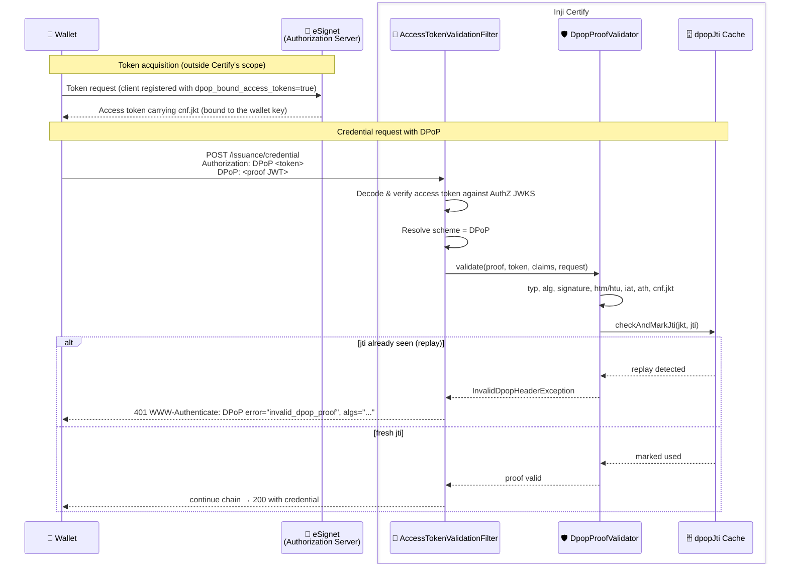

# DPoP Support (RFC 9449)

This document explains how Inji Certify supports **DPoP — Demonstrating Proof of Possession at the Application Layer** ([RFC 9449](https://www.rfc-editor.org/rfc/rfc9449.html)). DPoP lets a wallet bind an OAuth access token to a key pair it holds, so a token stolen in transit or from a log cannot be replayed by anyone who does not also hold the private key.

---

## Overview

A plain **Bearer** access token is a pure secret: whoever presents it is treated as the legitimate holder. If such a token leaks — from a proxy log, a mis-configured cache, or a compromised network hop — it can be replayed against the credential endpoint until it expires.

DPoP turns the token into a **sender-constrained** credential:

- The authorization server stamps a confirmation claim (`cnf.jkt`) into the token — the thumbprint of the wallet's public key.
- On every call the wallet also sends a short-lived **DPoP proof** JWT signed with the matching private key.
- Certify accepts the token only when the proof demonstrates possession of that key.

A stolen token is then useless without the private key.

> **Note:** DPoP defends against a *stolen token alone* — not against a full request replay. If an attacker captures **both** the token and an as-yet-unused proof, they can use that proof once, before the wallet does; the wallet's own request is then rejected as a replay (the `jti` cache only rejects *later* reuses, within the freshness window). Protect every hop with **TLS** so token and proof are never exposed in transit.

**Inji Certify is the resource server** in this model — it consumes and validates DPoP; it does **not** issue DPoP-bound tokens.

> **Note:** Because Certify never stamps `cnf.jkt`, access tokens minted by Certify's own `/oauth/token` — the pre-authorized code flow and the Presentation During Issuance flow — are plain Bearer tokens. DPoP therefore applies only when an **external authorization server** such as eSignet issues the token; it does not apply to tokens Certify issues itself.

| Party | Role | Responsibility |
|---|---|---|
| Wallet | DPoP client | Generates the key pair, obtains a bound token, signs a fresh proof per request |
| eSignet (or compatible AS) | Authorization server | Mints the access token and stamps `cnf.jkt` |
| **Inji Certify** | **Resource server** | Validates the proof and enforces the token↔proof↔key binding |

> **Note:** Certify only sees a `cnf.jkt` claim if the authorization server binds the token. In eSignet this happens for clients registered with `additionalConfig.dpop_bound_access_tokens: true`, supported in recent eSignet releases. Against an older authorization server no token carries `cnf.jkt`, so every DPoP path fails by construction.

---

## Accepting a Token: Bearer vs DPoP

Certify accepts an access token under either the `Bearer` or the `DPoP` authorization scheme, on the URLs listed in `mosip.certify.authn.filter-urls`. `AccessTokenValidationFilter` decodes and verifies the access token the same way for both schemes, then applies the scheme rules below. Because the token is fully signature-verified before its `cnf.jkt` is read, the binding is trustworthy.

| Token | Presented as | Result | Reason |
|---|---|---|---|
| plain (no `cnf`) | `Bearer` | **accepted** | ordinary Bearer flow |
| DPoP-bound (`cnf.jkt`) | `DPoP` + valid proof | **accepted** | proof demonstrates possession |
| DPoP-bound (`cnf.jkt`) | `Bearer` | **refused** | downgrade guard (RFC 9449 §7.2) |
| plain (no `cnf`) | `DPoP` | **refused** | nothing to bind the proof to |

The **downgrade guard** (RFC 9449 §7.2, *Compatibility with the Bearer Authentication Scheme*) is the point of the feature: accepting a sender-constrained token as a plain Bearer token would silently discard exactly the protection the binding provides, letting a stolen token work again. Scheme names are compared case-insensitively (`DPoP`, `dpop`, `Bearer`, `bearer` all resolve).

---

## Proof Validation

`DpopProofValidator` decides everything about the proof. It is a Spring component (not its own filter) because `AccessTokenValidationFilter` has already decoded and verified the access token by the time it runs. The checks, in order:

| # | Check | Rule |
|---|---|---|
| 1 | **Structure** | Exactly one proof; parses as a JWS |
| 2 | **`typ` header** | Must be `dpop+jwt` |
| 3 | **`alg` header** | Must be an allowed **asymmetric** algorithm; MAC and `none` are never allowed |
| 4 | **Embedded key** | Header must embed a public `jwk` (private keys rejected) |
| 5 | **Signature** | Verified against the embedded `jwk` (RSA / EC / Ed25519) |
| 6 | **`htm`** | Must equal the HTTP method of the request |
| 7 | **`htu`** | Must equal the request URL, compared ignoring query/fragment |
| 8 | **`iat` freshness** | Must be within `proof-max-age` (± `clock-skew`) |
| 9 | **`ath`** | Must equal the base64url SHA-256 hash of the presented access token |
| 10 | **`cnf.jkt`** | The embedded key's thumbprint must equal `cnf.jkt` in the access token |
| 11 | **`jti` replay** | Must not have been seen before (single-use) |

Two design points worth noting:

- **`htu` is compared against the issuer's public domain URL** (`mosip.certify.domain.url` + request URI), **not** `request.getRequestURL()`. Certify typically runs behind a reverse proxy, so the URL Tomcat sees is the internal one, while the wallet signs `htu` over the public `credential_endpoint` it read from the issuer metadata. Comparing against the container's view would reject every proof in a proxied deployment.
- **Replay is checked last.** A proof's `jti` is only marked used once every other DPoP validation check has passed, so a proof rejected by an earlier DPoP validation check does not burn a valid `jti`. (Note: `jti` is marked during proof validation, before the request reaches downstream processing — a request rejected *after* successful proof validation has already consumed its `jti`.)

> **Note:** Used `jti` values are remembered in the `dpopJti` cache. Its TTL (`mosip.certify.dpop.jti.expire.seconds`) **must exceed** `proof-max-age + 2 * clock-skew` — a proof accepted at the maximum future `iat` (`now + clock-skew`) stays fresh for `proof-max-age + 2 * clock-skew` after acceptance, so a shorter TTL could evict its `jti` while the proof is still replayable. In multi-replica deployments use a distributed cache (`spring.cache.type=redis`) — with `spring.cache.type=simple` each pod keeps its own `dpopJti` map, so a replayed proof only needs to land on a different pod to slip through.

---

## Sequence Diagram for a DPoP-Bound Credential Request



---

## Failure Responses

Every failure answers **`401 Unauthorized`** with a `WWW-Authenticate` challenge **in the scheme the caller used** (RFC 9449 §7.1) — a DPoP client is challenged with `DPoP`, a Bearer client with `Bearer`. The challenge carries `error`, `error_description`, and — for `invalid_dpop_proof` — an `algs` list advertising which algorithms a proof may be signed with. The `error_description` names the failing claim, so a wallet developer is told which specific check rejected the proof rather than a bare `invalid_dpop_proof`.

Example challenge for a rejected proof:

```
HTTP/1.1 401 Unauthorized
WWW-Authenticate: DPoP error="invalid_dpop_proof", error_description="DPoP proof ath does not match the presented access token", algs="ES256 ES384 ES512 RS256 PS256 EdDSA"
```

---

## Configuration Properties

| Property Name | Description | Example Value |
|---|---|---|
| `mosip.certify.authn.filter-urls` | URLs on which the access-token (Bearer/DPoP) filter runs. | `{ '${server.servlet.path}/issuance/credential'}` |
| `mosip.certify.domain.url` | Public issuer address; basis for the `htu` check (see note above). | `http://localhost:8090` |
| `mosip.certify.dpop.allowed-algorithms` | Signature algorithms accepted on a DPoP proof, and advertised in the `algs` challenge parameter. Asymmetric only. | `ES256,ES384,ES512,RS256,PS256,EdDSA` |
| `mosip.certify.dpop.proof-max-age` | How old a proof's `iat` may be, in seconds. | `60` |
| `mosip.certify.dpop.clock-skew` | Tolerance for device clock drift, applied on both sides of the freshness window. | `10` |
| `mosip.certify.dpop.jti.expire.seconds` | `jti` replay-cache TTL. **Must exceed** `proof-max-age + 2 * clock-skew`, or an evicted `jti` leaves its proof replayable. | `120` |
| `mosip.certify.cache.names` | Must include `dpopJti` for the replay cache to exist. | `...,dpopJti` |
| `mosip.certify.cache.expire-in-seconds` | Per-cache TTL map; must include a `dpopJti` entry (wired to `mosip.certify.dpop.jti.expire.seconds`), otherwise the TTL rule above is never applied. | `{..., 'dpopJti': ${mosip.certify.dpop.jti.expire.seconds}}` |
| `mosip.certify.cache.size` | Per-cache max-entries map for the `simple` (in-memory) cache; give `dpopJti` a bound so the replay cache does not grow unboundedly. | `{..., 'dpopJti': 10000}` |

---

## Conformance Testing

A 26-scenario Postman conformance suite exercises every rule above — structure, algorithm, signature, `htm`/`htu`, freshness, `ath`, `cnf.jkt` binding, the Bearer/DPoP downgrade guard, and `jti` replay. See:

- [README-mock-identity-dpop.md](../postman_collections/authorization_code_flow/data_provider_plugin/README-mock-identity-dpop.md)
- Collection: `inji-certify-with-mock-identity-dpop.postman_collection.json`
- Environment: `inji-certify-with-mock-identity-dpop.postman_environment.json` (`ENV Mock Identity DPoP`)

---

## References

- [RFC 9449 — OAuth 2.0 Demonstrating Proof of Possession (DPoP)](https://www.rfc-editor.org/rfc/rfc9449.html)
- [RFC 9110 — HTTP Semantics §11.1 (authentication scheme)](https://www.rfc-editor.org/rfc/rfc9110.html#section-11.1)
- [RFC 6749 — OAuth 2.0 Authorization Framework](https://www.rfc-editor.org/rfc/rfc6749.html)
- [Inji Certify API documentation](https://mosip.stoplight.io/docs/inji-certify)

---
