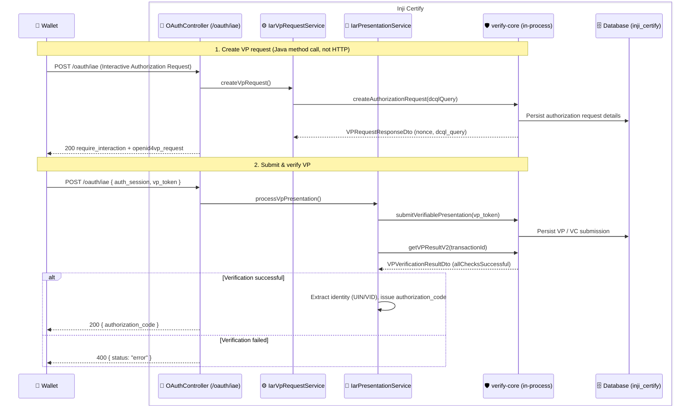

# Inji Verify as a Library

This document explains how Inji Certify uses **Inji Verify as an embedded library** (`verify-core`) to create and verify Verifiable Presentations during the **Presentation During Issuance** (Interactive Authorization Request / IAR) flow — instead of calling a separately deployed VP Verifier service over HTTP.

> **Note:** Read [Presentation During Issuance](./Presentation_During_Issuance.md) for the end-to-end flow and [DCQL Support](./DCQL_Support.md) for how the presentation request is expressed. This document focuses on the library integration itself.

---

## Overview

The Presentation During Issuance flow needs a **VP Verifier**: something that builds an OpenID4VP authorization request, receives the wallet's `vp_token`, and cryptographically verifies it before Certify issues an authorization code.

Running that verifier as a **separate microservice** means an extra deployable, extra network hops on the critical issuance path, extra TLS/config surface, and an extra failure mode (the verifier being unreachable). For a single-issuer deployment this is a lot of moving parts for a step that is logically part of issuance.

Instead, Certify embeds Inji Verify's **`verify-core`** as an in-process library. The VP request-creation and verification logic runs inside the Certify JVM — no separate service, no inter-service HTTP for verification.

---

## What "as a Library" Means

Certify depends on the `verify-core` artifact and wires its Spring beans into the Certify application context.

**1. Maven dependency** (`certify-service/pom.xml`):

```xml
<dependency>
    <groupId>io.inji.verify</groupId>
    <artifactId>verify-core</artifactId>
    <!-- Use the same version declared in certify-service/pom.xml -->
    <version>...</version>
    <!-- pixelpass-jar excluded to avoid a duplicate with Certify's own copy -->
    <exclusions>
        <exclusion>
            <groupId>io.inji</groupId>
            <artifactId>pixelpass-jar</artifactId>
        </exclusion>
    </exclusions>
</dependency>
```

**2. Configuration import and component scan** (`CertifyServiceApplication.java`):

```java
@Import(io.inji.verify.config.AppConfig.class)
@SpringBootApplication(scanBasePackages = "io.mosip.certify,"
        + /* ... kernel packages ... */
        + "io.inji.verify.services,"
        + "io.inji.verify.key.impl,"
        + "io.inji.verify.repository,"
        + "io.inji.verify.validator,"
        + "${mosip.certify.integration.scan-base-package}")
```

Two library beans are then injected directly into Certify services:

| Library bean | Used by | Purpose |
|---|---|---|
| `VerifiablePresentationRequestService` | `IarVpRequestService` | Build an OpenID4VP authorization request (by value) from a DCQL query |
| `VerifiablePresentationSubmissionService` | `IarPresentationService` | Accept the wallet's `vp_token` and return the verification result |

Because the two are in the same process, the "call" to the verifier is a **Java method call**, not an HTTP request.

---

## Request Creation — `IarVpRequestService`

When the wallet starts the IAR flow, Certify builds the VP request through the library:

1. Load the VP request configuration (`mosip.certify.vp-request.config-file-url`) into a `VerifyServiceConfig`, which carries the [`dcqlQuery`](./DCQL_Support.md) block.
2. Build a `VPRequestCreateDto` (verifier `clientId`, a `dcqlQuery`, `responseCodeValidationRequired=false` — Certify does not use verify-core's response-code flow).
3. Call `vpRequestService.createAuthorizationRequest(dto, Optional.empty())`. `submissionOrigin` is `empty` because Certify uses `direct_post`, not the DC API.
4. Map the library's `VPRequestResponseDto` into Certify's `VerifyVpResponse`, then assemble the wallet-facing `openid4vp_request` (mapping `direct_post`/`direct_post.jwt` to `iae_post`/`iae_post.jwt` — only `iae_post` (unencrypted) is supported for now — and setting `response_uri` to Certify's own `/oauth/iae`).

The `nonce` for replay protection is generated by the library (except on the `local` profile, where a hardcoded nonce can be used for deterministic testing — see below).

---

## Verification — `IarPresentationService`

When the wallet posts its VP back to `/oauth/iae`:

1. Certify validates the `auth_session` and loads the stored `IarSession` (holding `requestId` / `transactionId`).
2. It extracts `vp_token` from the wallet payload and calls `vpSubmissionService.submitVerifiablePresentation(vpTokenJson, requestId, null, null, Optional.empty())`. In DCQL mode only `vp_token` and state are needed — there is **no** `presentation_submission`.
3. It fetches the result with `vpSubmissionService.getVPResultV2(request, transactionId)` and inspects `isAllChecksSuccessful()`.
4. On success Certify extracts the identity attribute (UIN/VID) from the verified credential and issues an authorization code; on failure it returns an error status. **The authorization code is generated only after the library reports successful cryptographic verification.**

---

## Sequence Diagram for the Embedded Library



---

## Persistence

`verify-core` brings its own JPA entities and repositories (component-scanned above). Their tables are created by the Certify DB scripts and live in the **same `inji_certify` database/schema** as the rest of Certify, so the embedded library shares Certify's datasource — no separate database for the verifier:

- `db_scripts/inji_certify/ddl/verify-authorization_request_details.sql`
- `db_scripts/inji_certify/ddl/verify-vp_submission.sql`
- `db_scripts/inji_certify/ddl/verify-vc_submission.sql`

---

## Local Testing Note

On the `local` profile the VP request config (`vp_request_config-local.json`) may carry hardcoded `clientId` and `nonce` values matching a sample VP token, so the library's signature / domain / challenge checks pass deterministically. **These overrides are honored only on the `local` profile**; on any other profile they are ignored (with a warning) so the library generates its own nonce and VP replay protection is preserved. See [DCQL Support](./DCQL_Support.md#local-testing-note).

---

## Configuration Properties

| Property Name | Description | Example Value |
|---|---|---|
| `mosip.certify.vp-request.config-file-url` | VP request configuration carrying the `dcqlQuery`. Classpath resource on the `local` profile; fetched over HTTP(S) otherwise. | `vp_request_config-local.json` (local); `http://certify-nginx/vp_request_config.json` (deployed) |
| `mosip.certify.verify.service.verifier-client-id` | Verifier `client_id` the library uses when creating the authorization request. | `certify-verifier-client` |
| `mosip.certify.oauth.interactive-authorization-endpoint` | Certify's IAR endpoint, used as the `response_uri` where the wallet submits the VP. | `${mosip.certify.authorization.url}${server.servlet.path}/oauth/iae` |
| `inji.vp-request.long-polling-timeout` | `verify-core` long-polling timeout (ms) for awaiting a VP submission. | `55000` |
| `inji.vp-submission.base-url` | Base URL the library uses for VP submission handling. | `${mosip.certify.oauth.interactive-authorization-endpoint}` |
| `inji.keystore.file.path` | Keystore `verify-core` uses for VP verification. The bundled `classpath:sample-keystore/test.p12` is **for development only** and **must be replaced** with a production keystore. | `classpath:sample-keystore/test.p12` |
| `inji.keystore.file.pass` | Password for the keystore above. The sample value `mosip` is **for development only** and must be changed in production. | `mosip` |
| `inji.did.verify.public.key.uri` | DID URL (with key fragment) of the public key used to verify the VP. | `${mosip.certify.data-provider-plugin.did-url}#key-0` |
| `inji.did.verify.uri` | DID of the issuer/verifier identity resolved during VP verification. | `${mosip.certify.data-provider-plugin.did-url}` |
| `inji.verify.claims-with-meta-data` | Claims `verify-core` treats as metadata (not selectively-disclosable payload) during SD-JWT VP verification. | `_sd,_sd_alg,iss,cnf,sub,aud,exp,nbf,iat,cti` |
| `inji.verify.redirect-uri` | Base URI to which `#response_code=<code>` is appended and returned to the wallet (response-code flow). | `${mosip.certify.domain.url}${server.servlet.path}` |

---

## References

- [Presentation During Issuance](./Presentation_During_Issuance.md) — the flow this library powers.
- [DCQL Support](./DCQL_Support.md) — how the presentation request the library builds is expressed.
- [Inji Certify API documentation](https://mosip.stoplight.io/docs/inji-certify)

---
